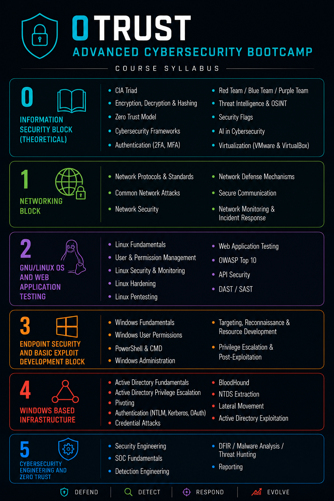
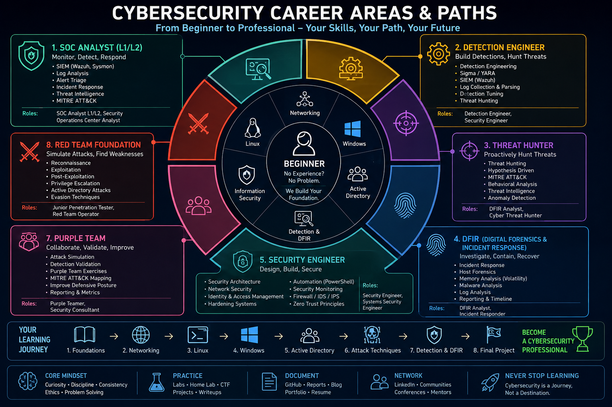

#  0Trust - Advanced Cybersecurity Bootcamp

 

---

# 0Trust - Advanced Cybersecurity Bootcamp

### **Defend • Detect • Respond • Evolve**

Modern enterprise cybersecurity training covering Offensive Security, Detection Engineering, Blue Team Operations, Windows Infrastructure, Web Security, Linux, Active Directory and Zero Trust.

## 📖 Course Overview

    

---

# ⚠️ Public Course Preview

> [!WARNING]
>
> This repository is a **public preview** of the **0Trust - Advanced Cybersecurity Bootcamp** and **does not include the complete curriculum**.
>
> The public syllabus covers only the major learning blocks. Practical laboratories, enterprise attack simulations, detection engineering projects, instructor methodologies, real-world case studies, assessments, and capstone projects are intentionally **not published**.
>
> ### 🔒 What's intentionally omitted
>
> - Hands-on Labs
> - Enterprise Attack Scenarios
> - Detection Engineering Projects
> - Active Directory Attack Chains
> - Threat Hunting Exercises
> - Malware Analysis Labs
> - Instructor Walkthroughs
> - Student Assessments
> - Capstone Projects
> - Instructor-only Material
>
> **Think of this repository as the table of contents—not the book.**

---

# 📚 Course Syllabus

## 0. Information Security Block (Theoretical)

### Foundations

- CIA Triad
- Encryption, Decryption & Hashing
- Zero Trust Model
- Cybersecurity Frameworks
- Authentication (2FA / MFA)

### Security Concepts

- Red Team / Blue Team / Purple Team
- Threat Intelligence & OSINT
- Security Flags
- AI in Cybersecurity
- Virtualization (VMware & VirtualBox)

---

## 1. Networking Block

### Networking Fundamentals

- Network Protocols & Standards
- OSI Model
- TCP/IP
- IPv4 & IPv6
- Routing & Switching
- DNS
- DHCP
- NAT

### Network Security

- Common Network Attacks
- Network Security
- Secure Communication
- Network Defense Mechanisms

### Monitoring

- Network Monitoring
- Packet Analysis
- Incident Response

---

## 2. GNU/Linux OS & Web Application Testing

### GNU/Linux

- Linux Fundamentals
- Linux File System
- User & Permission Management
- Linux Security & Monitoring
- Linux Hardening
- Linux Pentesting

### Web Application Security

- Web Application Testing
- OWASP Top 10
- API Security
- DAST / SAST

---

## 3. Endpoint Security & Basic Exploit Development

### Windows

- Windows Fundamentals
- Windows User Permissions
- PowerShell
- CMD
- Windows Administration

### Offensive Operations

- Targeting
- Reconnaissance
- Resource Development
- Privilege Escalation
- Post-Exploitation

---

## 4. Windows Based Infrastructure

### Active Directory

- Active Directory Fundamentals
- Active Directory Privilege Escalation
- Active Directory Exploitation

### Authentication

- NTLM
- Kerberos
- OAuth

### Enterprise Operations

- Pivoting
- Credential Attacks
- BloodHound
- NTDS Extraction
- Lateral Movement

---

## 5. Cybersecurity Engineering & Zero Trust

### Security Engineering

- Security Engineering
- SOC Fundamentals
- Detection Engineering

### Blue Team Operations

- DFIR
- Malware Analysis
- Threat Hunting

### Professional Skills

- Reporting
- Documentation
- Security Recommendations

---

# 🧰 Technologies

| Category | Technologies |
|-----------|--------------|
| Operating Systems | Windows • Linux |
| Infrastructure | Active Directory |
| Networking | TCP/IP • DNS • DHCP • Wireshark |
| Web Security | Burp Suite • OWASP Top 10 • API Security |
| Detection | Wazuh • Sysmon • Sigma Rules |
| Frameworks | MITRE ATT&CK • NIST • CIS Controls |
| Scripting | PowerShell • Bash |
| Virtualization | VMware • VirtualBox |

---

# 🎯 Learning Outcomes

After successfully completing this bootcamp, students will be able to:

- Design secure enterprise environments
- Administer Windows and Linux systems
- Secure Active Directory infrastructures
- Perform web application security testing
- Analyze network traffic
- Detect and investigate cyber threats
- Build detection rules
- Conduct DFIR activities
- Apply Zero Trust principles
- Produce professional security reports

---

# 👥 Recommended For

- Beginners entering Cybersecurity
- SOC Analysts
- Security Engineers
- System Administrators
- IT Professionals
- Junior Penetration Testers
- Career Changers

---

    

# ⚖️ Ethical Use

> [!IMPORTANT]
> All practical exercises are intended **strictly for educational purposes** and must only be performed in authorized environments.
>
> Students are expected to comply with responsible disclosure practices, applicable laws, and professional ethical standards.

---

## 🛡️ 0Trust

### Advanced Cybersecurity Bootcamp

**Building the next generation of cybersecurity professionals.**

⭐ If you find this repository useful, consider giving it a star.

